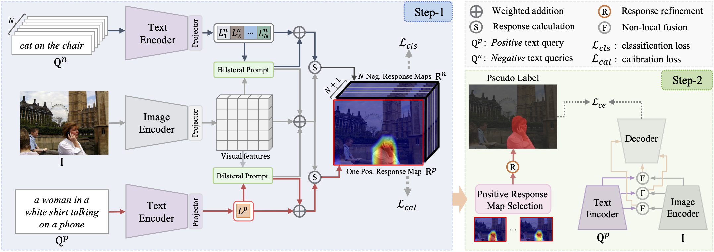

# [Referring Image Segmentation Using Text Supervision](https://arxiv.org/abs/2308.14575)

Official PyTorch implementation of **TRIS**, from the following paper:

[Referring Image Segmentation Using Text Supervision](https://arxiv.org/abs/2308.14575). ICCV 2023. \
[Fang Liu](https://scholar.google.com/citations?user=cBFup5QAAAAJ&hl=en&oi=sra)\*, [Yuhao Liu](https://scholar.google.com/citations?user=eHWiGU8AAAAJ&hl=en&oi=sra)\*, [Yuqiu Kong](https://scholar.google.com/citations?user=nKrhk4UAAAAJ&hl=en&oi=sra), [Ke Xu](https://scholar.google.com/citations?user=2meBhbQAAAAJ&hl=en&oi=sra), [Lihe Zhang](https://scholar.google.com/citations?user=XGPdQbIAAAAJ&hl=en&oi=ao), [Baocai Yin](https://scholar.google.com/citations?user=uXtYy_8AAAAJ&hl=en&oi=sra), [Gerhard Hancke](https://scholar.google.com/citations?user=C2iR3xUAAAAJ&hl=en&oi=ao), [Rynson Lau](https://www.cs.cityu.edu.hk/~rynson/)


--- 
<p align="left">

</p>


## Environment

```bash
conda env create -f environment.yml
```

## Dataset 
### RefCOCO/+/g
1. Download refer annotations from [refer](https://github.com/lichengunc/refer).
2. Download `train2014` images from [COCO](https://cocodataset.org/#download).

```
├── data/
|   ├── train2014
|   ├── refer
|   |   ├── refcocog
|   |   |   ├── instances.json
|   |   |   ├── refs(google).p
|   |   |   ├── refs(umd).p
|   |   ├── refcoco
```

### ReferIt
1. Download parsed annotations from [our link](https://github.com/fawnliu/storage/releases/download/v1.0.2/referit_annotations.zip).
2. Download `saiapr_tc-12` images from [referit](https://web.archive.org/web/20220515000000/http://bvisionweb1.cs.unc.edu/licheng/referit/data/images/saiapr_tc-12.zip).

```
├── data/
|   ├── referit
|   |   ├── annotations
|   |   |   ├── train.pickle
|   |   |   ├── test.pickle
|   |   ├── images
|   |   ├── masks
```

If you want to generate referit annotations by yourself, refer to [MG](https://github.com/hassanhub/MultiGrounding/tree/master/data) for more details.


## Evaluation

1. Create the `./weights` directory 
```shell
mkdir ./weights
```
2. Download model weights using github links below and put them in `./weights`.

|  | ReferIt | RefCOCO | RefCOCO+ | G-Ref (Google) | G-Ref (UMD) |
|---|---|---|---|---|---|
|Step-1| [weight](https://github.com/fawnliu/storage/releases/download/v1.0.4/stage1_referit.pth) | [weight](https://github.com/fawnliu/storage/releases/download/v1.0.4/stage1_refcoco.pth) |  [weight](https://github.com/fawnliu/storage/releases/download/v1.0.4/stage1_refcoco+.pth) | [weight](https://github.com/fawnliu/storage/releases/download/v1.0.4/stage1_refcocog_google.pth) | [weight](https://github.com/fawnliu/storage/releases/download/v1.0.4/stage1_refcocog_umd.pth) |
|Step-2| [weight](https://github.com/fawnliu/storage/releases/download/v1.0.1/stage2_referit.pth) | [weight](https://github.com/fawnliu/storage/releases/download/v1.0.1/stage2_refcoco.pth) | [weight](https://github.com/fawnliu/storage/releases/download/v1.0.1/stage2_refcoco+.pth) | [weight](https://github.com/fawnliu/storage/releases/download/v1.0.1/stage2_refcocog_google.pth) | [weight](https://github.com/fawnliu/storage/releases/download/v1.0.1/stage2_refcocog_umd.pth) | 

3. Shell for `G-Ref(UMD)` evaluation. Replace `refcocog` with `refcoco`, and `umd` with `unc` for RefCOCO dataset evaluation. 

```bash
python validate.py  --batch_size 1  --size 320  --dataset refcocog  --splitBy umd  --test_split val  --max_query_len 20  --dataset_root ./data  --output weights/  --resume --pretrain  stage1_refcocog_umd.pth  --eval 
```
For ReferIt dataset:
```bash
python validate_referit.py   --batch_size 1   --size 320   --dataset referit   --test_split test   --backbone clip-RN50   --max_query_len 20   --dataset_root ./data/referit/   --output weights/   --resume --pretrain stage1_referit.pth   --eval 
```

## Demo
The output of the demo is saved in `./figs/`.
```bash
python demo.py  --img figs/demo.png  --text 'man on the right'
```

## Training

1. Train Step1 network on `Gref (UMD)` dataset.
```bash
python train_stage1.py  --batch_size 48  --size 320  --dataset refcocog  --splitBy umd  --test_split val  --epoch 15  --backbone clip-RN50  --max_query_len 20  --negative_samples 3  --output ./weights/refcocog_umd --board_folder ./output/board 
```

2. Validate and generate response maps on the  Gref (UMD) `train` set, based on the proposed PRMS strategy.

```bash
## path to save response maps and pseudo labels
dir=./output

python validate.py   --batch_size 1   --size 320   --dataset refcocog   --splitBy umd   --test_split train   --max_query_len 20   --output ./weights/refcocog_umd   --resume --pretrain  ckpt.pth   --cam_save_dir $dir/refcocog_umd/cam/   --name_save_dir $dir/refcocog_umd  --eval --prms 
```

3. Train IRNet and generate pseudo masks.

```bash
cd IRNet

dir=../output
CUDA_VISIBLE_DEVICES=0,1,2,3 python run_sample_refer.py   --cam_out_dir $dir/refcocog_umd/cam   --ir_label_out_dir $dir/refcocog_umd/ir_label   --ins_seg_out_dir $dir/refcocog_umd/ins_seg   --train_list $dir/refcocog_umd/refcocog_train_names.json   --cam_eval_thres 0.15   --work_space output_refer/refcocog_umd   --num_workers 8   --irn_batch_size 96   --cam_to_ir_label_pass True   --train_irn_pass True   --make_ins_seg_pass True 
```

4. Train Step2 network using the generated pseudo masks in `output/refcocog_umd/ins_seg` (pseudo_path). 

```bash
cd ../

python train_stage2.py  --batch_size 48  --size 320  --dataset refcocog  --splitBy umd  --test_split val  --bert_tokenizer clip  --backbone clip-RN50  --max_query_len 20  --epoch 15  --pseudo_path output/refcocog_umd/ins_seg  --output ./weights/stage2/pseudo_refcocog_umd
```

## Acknowledgement
This repository was based on [LAVT](https://github.com/yz93/LAVT-RIS), [WWbL](https://github.com/talshaharabany/what-is-where-by-looking), [CLIMS](https://github.com/CVI-SZU/CLIMS) and [IRNet](https://github.com/jiwoon-ahn/irn).


## Citation
If you find this repository helpful, please consider citing:
```bibtex
@inproceedings{liu2023referring,
  title={Referring Image Segmentation Using Text Supervision},
  author={Liu, Fang and Liu, Yuhao and Kong, Yuqiu and Xu, Ke and Zhang, Lihe and Yin, Baocai and Hancke, Gerhard and Lau, Rynson},
  booktitle={Proceedings of the IEEE/CVF International Conference on Computer Vision},
  pages={22124--22134},
  year={2023}
}
```


## Contact
If you have any questions, please feel free to reach out at `fawnliu2333@gmail.com`.
